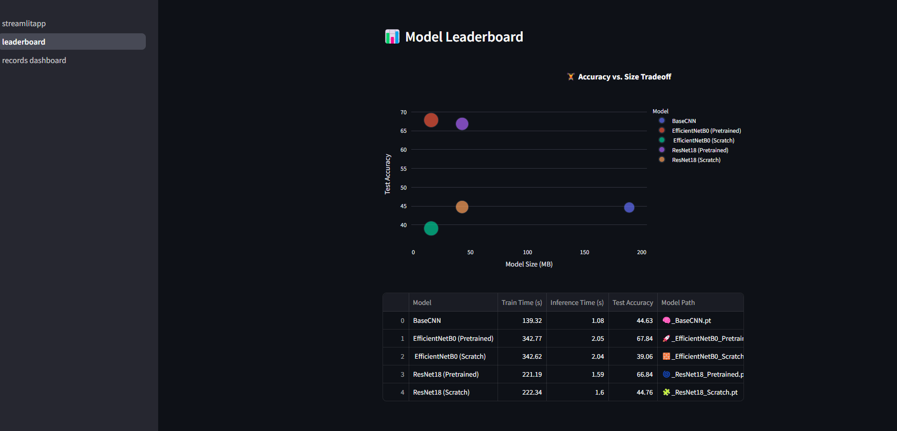

# 🦷 TeethVision AI: Smart Dental Diagnosis App

Welcome to **TeethVision AI**, an intelligent deep learning-powered application designed to assist dental clinics in classifying and tracking oral diseases using dental X-ray images. Built with **PyTorch**, **Streamlit**, and **SQLite**, this platform enables fast, accurate predictions while saving patient records and offering a sleek, interactive dashboard for clinical use.

---

## 🚀 Demo

🎥 **Video Demonstration**  
📺 [Watch Demo Video](static/demo_video/demo.mp4)

---

📸 **App Screenshots**

- **Home Page**  
  

- **Leaderboard Page**  
  

- **Patient Records Database**  
  


---

## 📦 Features

- 🔍 **Multi-model Inference:** Choose from BaseCNN, EfficientNetB0, and ResNet18 (pretrained & scratch).
- 📈 **Leaderboard Dashboard:** Compare models by accuracy, size, train/test time.
- 🧑‍⚕️ **Patient Management System:** Save predictions with patient name and history.
- 📅 **Search & Filter:** Query by patient or date, preview images, export results.
- 💽 **Lightweight DB:** Uses local SQLite database to log predictions.
- 📊 **Interactive Charts:** Real-time confidence, softmax visualizations, and more.

---

## 📁 Project Structure

```
TeethVision-AI/
├── app.py                      # Main Streamlit App
├── config.py                   # Model paths and classes
├── utils.py                    # Image processing and prediction
├── utils_db.py                 # SQLite DB operations
├── pages/
│   ├── leaderboard.py          # Model comparison visualizations
│   └── records_dashboard.py    # Patient records viewer
├── static/
│   ├── uploads/                # Saved images for each prediction
│   ├── home.png
│   ├── leaderoard.png
│   ├── database.png
│   └── demo_video/demo.mp4     # Demo video file
├── results/                    # Trained models & evaluation CSV
├── style.css                   # App styling
├── patients.db                 # SQLite database file
├── requirements.txt
└── README.md
```

---

## 🛠️ Installation

### 1. Clone the Repository

```bash
git clone https://github.com/yourusername/TeethVision-AI.git
cd TeethVision-AI
```

### 2. Create & Activate Environment

```bash
python -m venv venv
source venv/bin/activate     # or .\venv\Scripts\activate on Windows
```

### 3. Install Requirements

```bash
pip install -r requirements.txt
```

### 4. Initialize the Database

```bash
python init_db.py
```

### 5. Run the App

```bash
streamlit run app.py
```

---

## 🧠 Models Included

- 🧠 **BaseCNN** (custom scratch model)
- 🚀 **EfficientNetB0 (Pretrained)** ✅ *Recommended*
- 📅 **EfficientNetB0 (Scratch)**
- 🌀 **ResNet18 (Pretrained)**
- 🧩 **ResNet18 (Scratch)**

Models are saved in `results/` as `.pt` and `.onnx` for performance comparisons and deployment flexibility.

---

## ✅ Requirements

```
streamlit
numpy
pandas
Pillow
onnxruntime
plotly
torch
torchvision
sqlite3
```

> All dependencies are listed in `requirements.txt`.

---

## 👨‍💻 Author

Built with passion by [**Basel Amr Barakat**](https://www.linkedin.com/in/baselamrbarakat) 💙

[ LinkedIn](https://www.linkedin.com/in/baselamrbarakat)\
[ GitHub](https://github.com/Basel-Amr)

---

## 📜 License

This project is licensed for learning and demonstration purposes. For clinical/production usage, consult with regulatory compliance.

---

## ⭐ Final Note

If you like this project or find it useful, don’t forget to **star the repo**, share it with your peers, or reach out with feedback!

> 🦷 Empowering dentists with AI, one image at a time.

